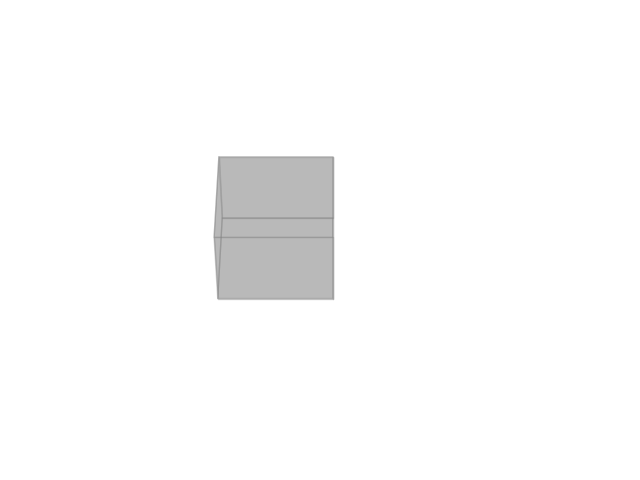

# TheBrainGame
- A 3D cellular automaton where each cell exists in either a resting state (0) or spiking state (1).
- Each cell has a unique threshold (0–7) and a unique connection to each adjacent neighbor (-1 or +1).
- A cell spikes (1) if the dot product of its connections and neighbor states meets or exceeds its threshold; otherwise, it rests (0).

